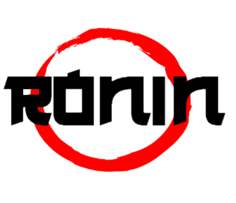
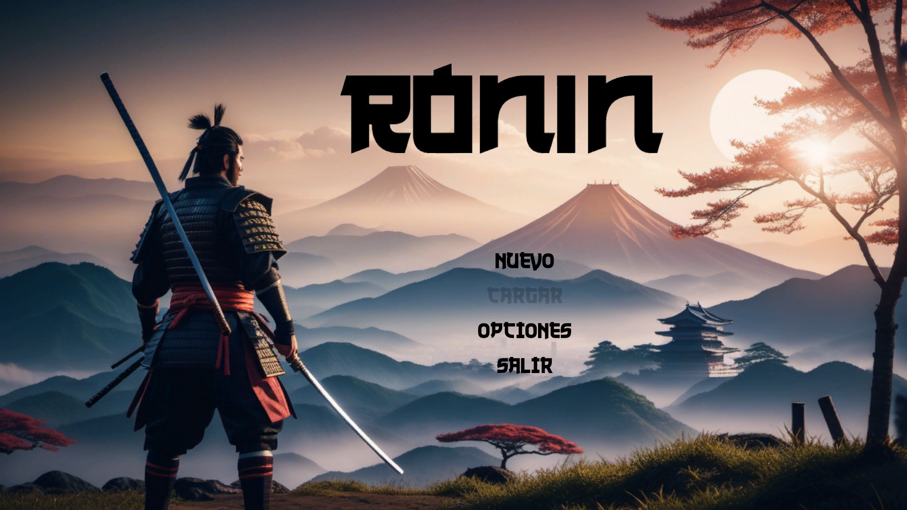
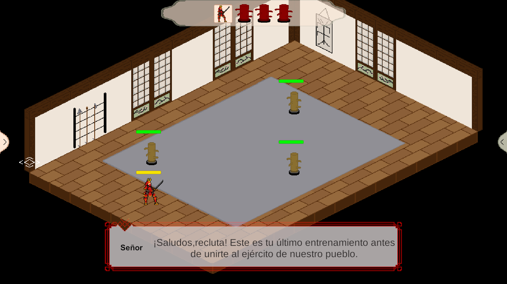
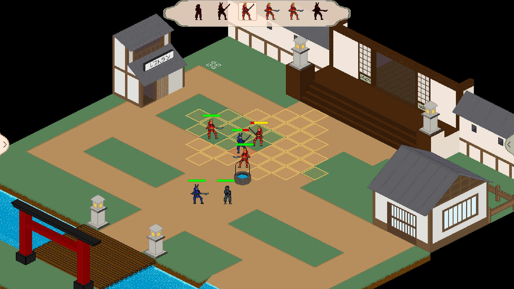

# RONIN

Ronin is a final year project that has feudal Japan as its theme. It is a 2D Tactical RPG made with Pixel Art.

## Demo

## Screenshots

## Authors

- [@JvrGrc](https://www.github.com/JvrGrc)
- [@Alvpen](https://github.com/Alvpen)

## License

[GNU GPLv3](https://choosealicense.com/licenses/gpl-3.0/)

## Tech Stack

This project has been developed by using Unity and C#.
Also the art of the game has been made using Aseprite for the characters and Photoshop to create the logo and some posters for advertising.

## Installation

For installation just download the project and go to the "Game" folder.
There you are going to find the .exe so you could try a demo of the game

## Support

For support, email javi.principal22@gmail.com
